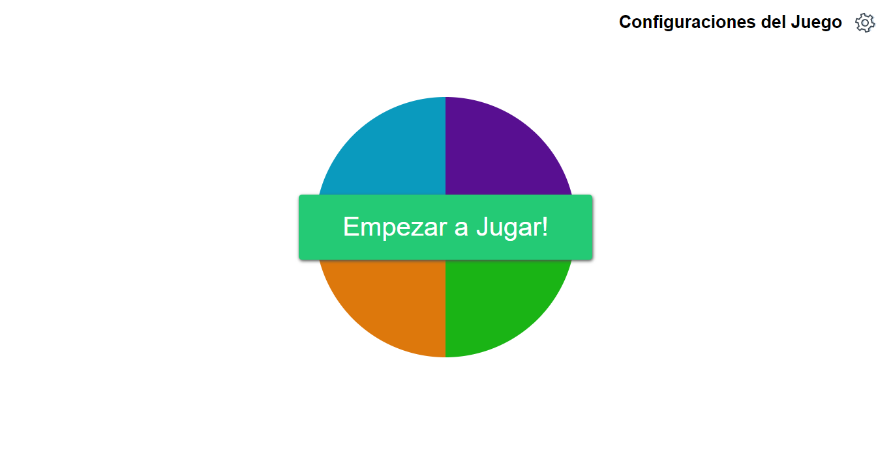

### The classic game of following the patron saint of colors, project resulting from the course of JavaScript Basics of Platzi. Levels and speeds can be configured.
 

## License
JuegoSimon is released under the [GPL-3.0 License](https://opensource.org/licenses/GPL-3.0).
